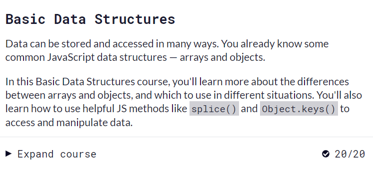

# kottans-frontend

## Hi, everyone!
My name is Serhii.
I was familiar with Git and GitHub before, in the first task I did the merge of remote repositories for the first time, I can’t say that everything worked out the first time, it was an interesting experience.

---

## Linux CLI, and HTTP
[Linux Survival](https://linuxsurvival.com/) Great tool for training Linux commands

Some of the commands were familiar, and as for access rights and viewing workflows, completing them is a new skill that I received in this lesson.
In the [task_linux _cli](./task_linux_cli/) folder, screenshots of the answers to the quiz can be used as a reminder

---

[HTTP: Протокол, який повинен розуміти кожний веб-розробник (Частина 1)](https://code.tutsplus.com/uk/tutorials/http-the-protocol-every-web-developer-must-know-part-1--net-31177)

[HTTP: Протокол, який повинен розуміти кожний веб-розробник (Частина 2)](https://code.tutsplus.com/uk/tutorials/http-the-protocol-every-web-developer-must-know-part-2--net-31155)

It was interesting to learn about different authorization systems and encryption, a lot of new and useful information.

---

## Git Collaboration

Usually, using GitHub and Git in individual projects, about 5-7 teams are used, another thing is teamwork, and then you understand how flexible and possible this tool is.
[Git simulator](https://learngitbranching.js.org/?locale=uk) - I liked it very much.

---

## Intro to HTML and CSS
Images of completed tasks in a folder [task_html_css_into](./task_html_css_intro/) 

CSS and HTML are what website developers constantly work with and their knowledge is the basis of website building.

--- 

## Responsive Web Design

I only knew the basics of CSS and there was a lot of useful information for me, I liked the game with frogs and helped me to try out the material covered in practice.

[Flexbox Froggy](http://flexboxfroggy.com/#ru) a simulator in which you can train flex in a playful way.

---

## HTML-CSS-Popup — #done
This task was not easy, a lot of time and nerves were spent to consolidate the theory in practice :)

---

## JS Basics

###Introduction to Javascript - [folder with screenshots of the course](./js_basics/coursera/)

---

## DOM